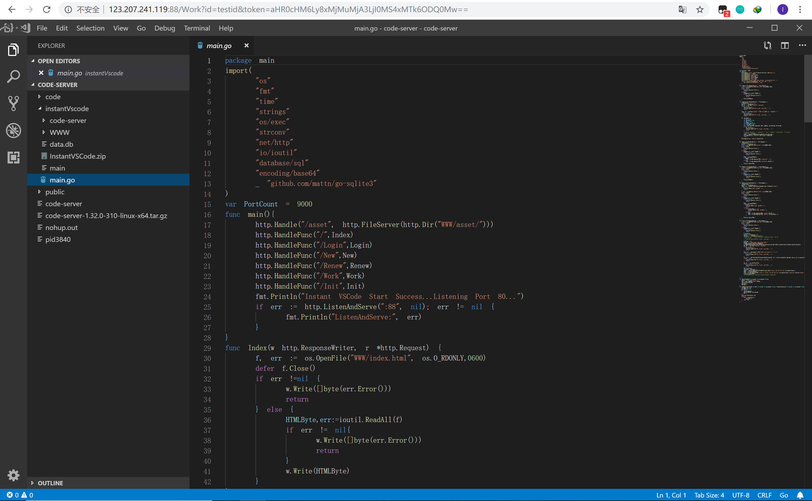
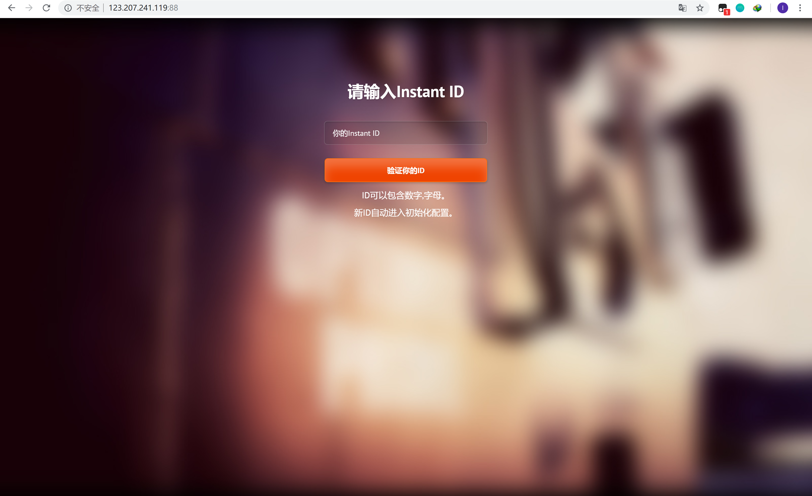
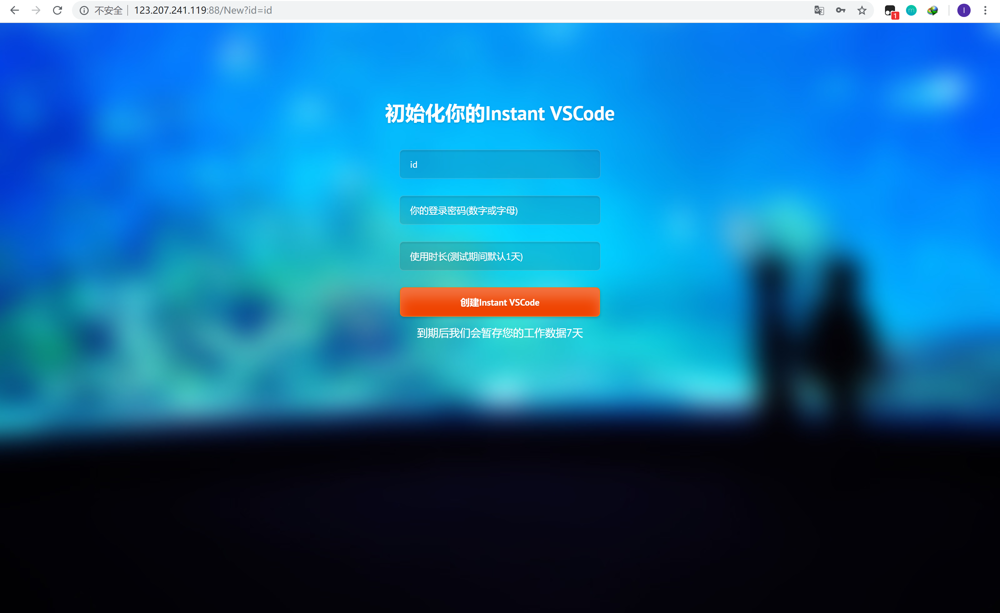

Instant VSCode
==============

首先感谢code-server github: <https://github.com/codercom/code-server>

作为一个程序猿，有时总是会突然需要编码，偏偏有时又没带自己的电脑，别人的电脑又没有各类环境和IDE

所以呢，我基于Code-Server编写了这样一个可以短期租用的在线VSCode

用户自定义一个ID，输入ID和密码，即可进入Online VSCode，带有全功能Web Terminal

测试网址：<http://123.207.241.119:88>

不久之后将提供免费的Instant VSCode服务，可以访问<https://ide.onlinecode.cn>
(近期上线)

测试ID: testid

Online VSCode页面

ID验证：

初始化新的Instance VSCode：

